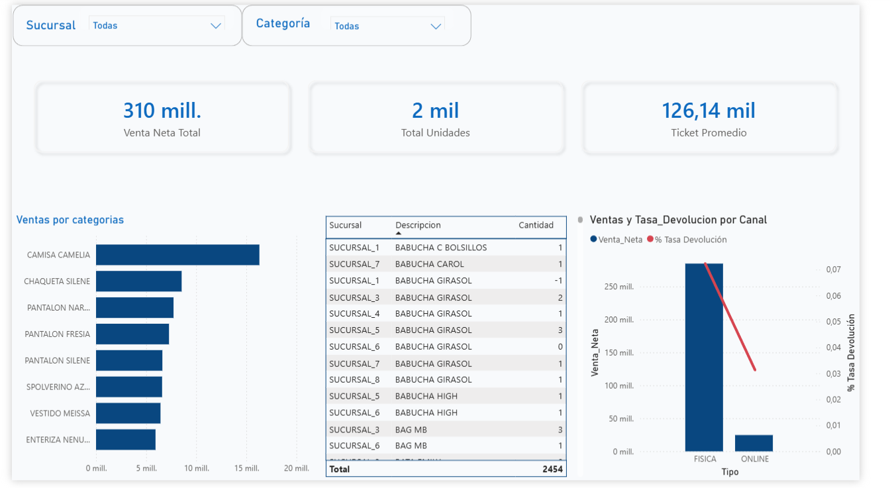
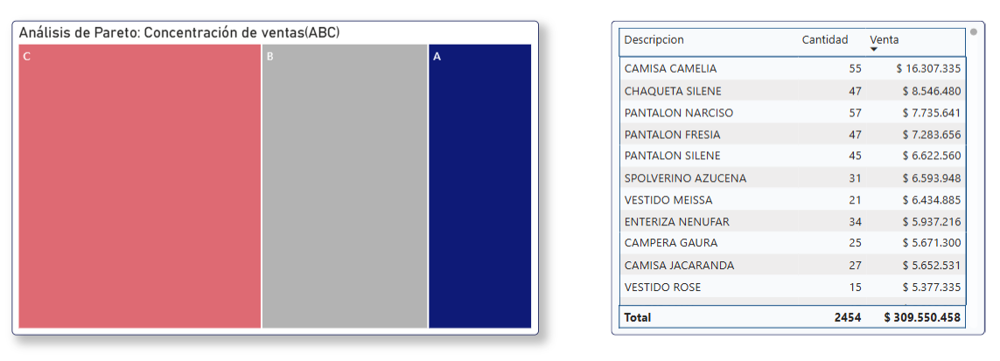
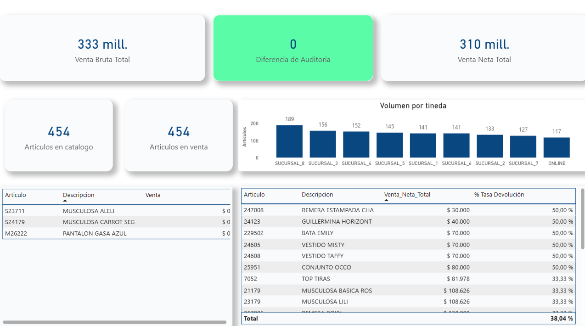

## 📊 Retail Performance, Pareto & Data Audit (Mammy Blue)

## 📋 Descripción

Proyecto integral de **Business Intelligence** y análisis de performance para **Mammy Blue**, marca de indumentaria en Argentina. Este desarrollo abarca desde el procesamiento de datos crudos (ETL) en Python hasta la creación de un sistema de auditoría y visualización estratégica en Power BI para la optimización de la rentabilidad.

> ⚠️ **Nota de Privacidad:** Los datos presentados han sido anonimizados para proteger la información comercial confidencial, manteniendo la integridad de la lógica de negocio y los patrones de análisis reales detectados en la operación.

## 🎯 Objetivo

Maximizar la eficiencia operativa mediante la identificación de productos críticos (Pareto ABC), la conciliación financiera de devoluciones y la detección proactiva de ineficiencias en el registro de ventas.

## 📊 Dataset

- **Fuente:** Reportes consolidados de ventas y maestro de artículos.
- **Volumen:** 1,301 registros transaccionales correspondientes a 454 artículos únicos.
- **Período:** Enero 2026.
- **Ubicación:** Argentina (Sucursales físicas y canal Online).

## 🛠️ Stack Técnico

- **Procesamiento:** Python (Pandas) para limpieza, normalización regional y cálculo de segmentación ABC.
- **Visualización:** Power BI (DAX Avanzado).
- **Modelado:** Esquema en Estrella (Star Schema) para optimización de consultas.
- **Metodología:** Análisis de Pareto y Auditoría de Integridad Referencial.

## 📁 Estructura del Proyecto

retail-performance-analysis/
├── data/
│   └── processed/        # CSVs finales (fact_ventas, dim_articulos)
├── scripts/
│   └── etl_process.py    # Lógica de limpieza y clasificación ABC
├── dashboard/
│   ├── main_report.png   # Dashboard Ejecutivo
│   ├── pareto_abc.png    # Análisis de Inventario
│   └── data_quality.png  # Auditoría de Calidad
└── powerbi/
    └── mammy_blue_audit_2026.pbix

## 📈 KPIs Principales

| KPI                                | Valor Actual           | Definición                                                      |
| :--------------------------------- | :--------------------- | :--------------------------------------------------------------- |
| **Venta Neta Final**         | **$309,550,458** | Facturación real tras deducir notas de crédito y devoluciones. |
| **Tasa de Devolución**      | **6.92%**        | Ratio de salud de ventas y calidad de producto.                  |
| **Artículos Catalogados**   | **454**          | Total de SKUs únicos validados en el maestro de artículos.     |
| **Diferencia de Auditoría** | **$0.00**        | Conciliación perfecta entre Venta Bruta, Devolución y Neta.    |

## 🚀 Visualizaciones y Análisis Estratégico

### 1. Panel de Control Ejecutivo

Vista centralizada para el monitoreo de la rentabilidad por sucursal. Permite identificar el peso del canal Online frente a los locales físicos y supervisar la oscilación de la tasa de devoluciones en tiempo real.

### 2. Análisis de Pareto ABC (Gestión de Inventario)

Implementación de la Ley de 80/20 para priorizar el stock. Se identificaron los artículos **Clase A** (como la Camisa Camelia) que traccionan la mayor parte de la facturación, diferenciándolos de los **Clase C** que representan un exceso de capital inmovilizado.

### 3. Módulo de Calidad y Auditoría de Datos

Página técnica diseñada para garantizar la veracidad del reporte. Incluye la validación del balance contable y la detección de anomalías de precio (registros de $0.01 de los artículos S24179, S23711 y M26222) y artículos con tasas de devolución críticas.

## 💡 Business Insights

- **Concentración de Ventas:** El análisis de Pareto permite enfocar los esfuerzos de reposición en el Top 20 de productos, reduciendo el riesgo de quiebre de stock en los artículos de mayor impacto.
- **Saneamiento Operativo:** La identificación de anomalías de precio permitió limpiar el Ticket Promedio, evitando distorsiones en las proyecciones de venta.
- **Alerta de Calidad:** La identificación de productos con devoluciones atípicas provee información valiosa para el control de calidad en la fabricación de nuevas tandas.

---

## 📅 Timeline

- **Inicio:** 26 de enero de 2026
- **Finalización:** 4 de febrero de 2026
